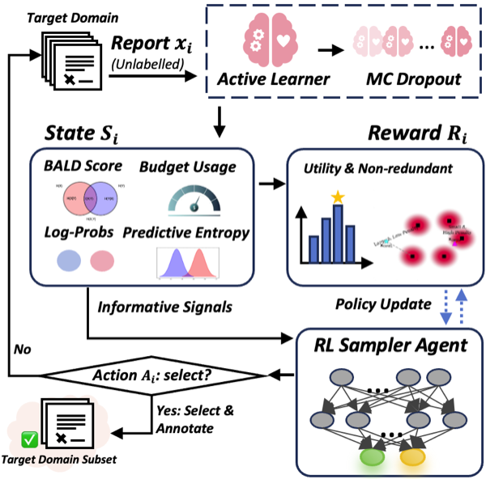

# RADS

[](https://aclanthology.org/2026.findings-acl.608/)


This is the official implementation of **RADS: Reinforcement Learning-Based Sample
Selection Improves Transfer Learning in Low-resource and Imbalanced Clinical
Settings**, published in *Findings of the Association for Computational
Linguistics: ACL 2026*.

- Paper: https://aclanthology.org/2026.findings-acl.608/


## Overview

RADS is an RL-based target sample selector for low-resource, class-imbalanced transfer learning.  
It combines:

1. source-domain active learning with MC dropout,
2. BALD-based informativeness scoring,
3. prior-aware utility for class-mixture control,
4. diversity-aware sequential selection with a dueling DQN sampler.

The selected target reports are then annotated and jointly used with the source data for transfer learning.

## Methodology

<p align="center">
  
</p>

At each step the active learner computes MC-dropout predictions on an unlabelled
target report `x_i`, yielding the state `s_i` (BALD score, log-probs, predictive
entropy, budget usage). The RL sampler agent takes action `A_i` — select or
skip — and receives a reward `R_i` that combines prior-aware utility with a
diversity / non-redundancy term. Selected reports are annotated and added to
the target-domain subset used jointly with the source data for transfer
learning.

## Main experiments

This repository focuses on the two main transfer settings in the paper:

- CHIFIR → PIFIR
- MIMIC-CXR → PIFIR


## Data Access

The original clinical datasets are not redistributed in this repository.

Please obtain them from the official sources:

PIFIR: https://physionet.org/content/pifir/1.0.0/

CHIFIR: https://physionet.org/content/corpus-fungal-infections/1.0.2/

MIMIC-CXR: https://physionet.org/content/mimic-cxr/2.1.0/

Place the files under data/raw/.

After download, the expected layout is:

```
data/raw/
├── CHIFIR_reports_dev.csv
├── CHIFIR_reports_test.csv
├── PIFIR_reports_dev.csv
├── PIFIR_reports_test.csv
├── MIMIC_reports_dev.csv  
└── MIMIC_reports_test.csv
```

## Quickstart

Tested with Python 3.10 and a single CUDA GPU (CPU also works for the smoke test).

```bash
# 1. Create environment
python -m venv .venv
source .venv/bin/activate
pip install -r requirements.txt

# 2. Place clinical CSVs under data/raw/ (see Data Access above)

# 3. Run the CHIFIR → PIFIR pipeline
python -m scripts.run_chifir_to_pifir --config configs/chifir_to_pifir.yaml

# 4. Run the MIMIC-CXR → PIFIR pipeline
python -m scripts.run_mimic_to_pifir --config configs/mimic_to_pifir.yaml
```

Each script will:

1. fine-tune the source-domain classifier (ClinicalBERT by default) and save a
   checkpoint under `outputs/<experiment>/source_ckpt/best/` (the MIMIC pipeline
   writes to `outputs/<experiment>/source_model/best/`),
2. run MC-dropout to compute BALD features over the target pool,
3. train the dueling-DQN selector and write `selected_indices.json` plus a
   `selection_summary.json` to `outputs/<experiment>/`.

The selected indices refer to row positions in the target pool CSV
(`data.target_train`). Joint fine-tuning on the selected target samples together
with the source data — the final step of the method — is not included in this
repository; these scripts cover source training, uncertainty estimation and
selection only.

To reuse a previously trained source checkpoint and skip step (1) in the CHIFIR
pipeline:

```bash
python -m scripts.run_chifir_to_pifir \
    --config configs/chifir_to_pifir.yaml \
    --source-checkpoint outputs/chifir_to_pifir/source_ckpt/best
```

## Repository layout

```
configs/         YAML configs for each transfer setting
scripts/         CLI entry points (one per setting)
src/rads/        Library code: data, train, uncertainty, rl_selector, evaluate, metrics
tests/           Smoke tests (`pytest tests/`)
```

## Smoke test

```bash
pytest tests/
```


## Citation

If you use this code or the RADS method, please cite:

```bibtex
@inproceedings{han-etal-2026-rads,
    title = "{RADS}: Reinforcement Learning-Based Sample Selection Improves Transfer Learning in Low-resource and Imbalanced Clinical Settings",
    author = "Han, Wei  and
      Martinez Iraola, David  and
      Khanina, Anna  and
      Cavedon, Lawrence  and
      Verspoor, Karin",
    editor = "Liakata, Maria  and
      Moreira, Viviane P.  and
      Zhang, Jiajun  and
      Jurgens, David",
    booktitle = "Findings of the {A}ssociation for {C}omputational {L}inguistics: {ACL} 2026",
    month = jul,
    year = "2026",
    address = "San Diego, California, United States",
    publisher = "Association for Computational Linguistics",
    url = "https://aclanthology.org/2026.findings-acl.608/",
    doi = "10.18653/v1/2026.findings-acl.608",
    pages = "12501--12516",
    ISBN = "979-8-89176-395-1"
}
```

## License

The code in this repository is released under the MIT License; see
[LICENSE](LICENSE) for the full text.

This does not cover the clinical datasets, which are not redistributed here and
remain governed by their own PhysioNet data use agreements.
